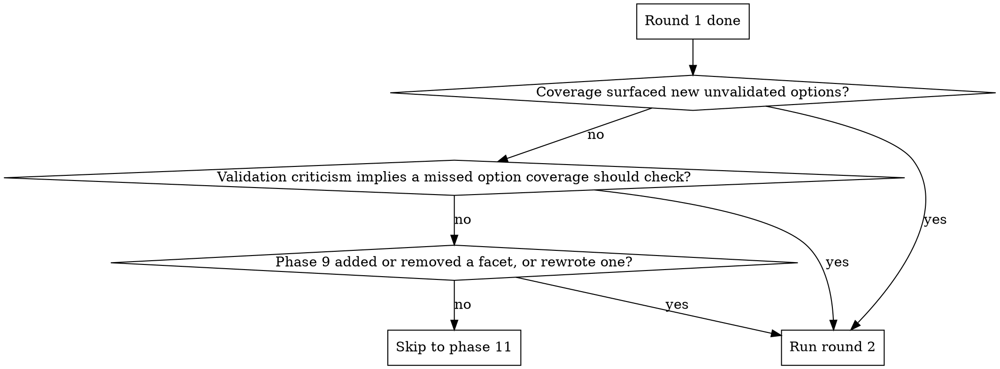

# Research

## Overview

Research drifts when nobody challenges it. This skill stages three independent challenges, each catching a different failure mode: a user-locked plan stops facet drift, parallel adversarial reviewers on the bullet draft stop unvalidated options, and a fresh-context review of the prose stops scope drift in the writeup.

**Announce at start:** "Using the research skill to investigate <topic>."

## When to use

- Topic has multiple plausible angles or options worth comparing.
- Output is a saved markdown report the user keeps and references later.
- Web evidence, sometimes paired with local code, is the primary input.

## When NOT to use

- One-shot factual lookup such as "what year was X released". Go straight to web search.
- Recall from a past conversation. Search project memory instead.
- Find something in this codebase. Use Grep or Serena symbol tools.
- In-conversation Q&A where the user does not want a saved artifact.
- Topic already covered by a canonical source you can cite without rewriting.

## Tool mapping

| Action | Claude Code | Codex |
|---|---|---|
| Web search | `WebSearch` | built-in web search |
| Read URL | SearXNG `web_url_read` (preferred), fallback `WebFetch` | built-in web fetch |
| Read local files | `Read`, `Grep`, Serena (`find_symbol` etc.) | `Read`, `Grep`, Serena |
| Dispatch reviewer | `Agent` tool (general-purpose subagent) | Codex subagent |

## Phases

The 15 phases group into three stages: **Plan** (1-5), **Investigate** (6-10), **Write** (11-15).

### Plan

#### 1. Intake

Ask clarifying questions one at a time. Cap at 3-4. Skip when the topic is already specific. Accept "just go" or similar as an immediate exit from intake (this exits intake only, not the plan checkpoint in phase 5).

Typical questions: scope (academic vs practitioner), audience (background level), time horizon, what existing knowledge to assume.

#### 2. Project relevance

Test: does the topic name a tech, library, concept, or pattern the current repo uses? If yes, mark which facets benefit from local file inspection. If no, web-only.

#### 3. Plan: 3-7 facets

Pick distinct angles. Per-option weak points and dissent are covered by the validation reviewer in phase 8, so a dedicated dissent facet is unnecessary.

Angle hints, pick what fits:
- Programming / CS: how-it-works, practitioner experience, criticisms, alternatives, history.
- Books / media recs: well-regarded, overrated, lesser-known, adjacent topics, critical reception.
- Historical / factual: primary sources, scholarly consensus, revisionist views.
- Decisions / comparisons: pros, cons, hidden tradeoffs, what experienced people pick.
- "What should I learn next" type: case for, case against, prerequisites, what comes after.

#### 4. Plan self-review (in-context)

Single critique pass. Checklist:
- Are angles genuinely distinct, or are two of them basically the same?
- Are there obvious gaps for the topic type?

If any check fails, revise once and re-check. Cap at one revision. If the second draft still fails, ship it with the unresolved gaps noted in a one-line self-review summary. Show the user only the post-revision version.

#### 5. User confirms plan

**Mandatory checkpoint.** The user can edit, drop, or add facets. Wait for OK before investigating.

**Why mandatory:** facet selection is where most drift originates. A misframed plan produces a misframed report; later phases polish prose but cannot reframe the question.

### Investigate

#### 6. Investigate

For each facet:
- Web search, then URL read for the most promising sources.
- Light counter-evidence sweep ("X criticisms", "problems with X", "X overrated"). Enough to fill preliminary cons in the bullet draft.
- For project-relevant facets: also read the relevant local files.

Collect quotes, URLs, and per-facet preliminary cons as you go.

#### 7. Bullet-form tentative draft

Internal scratch, not shown to the user. Assemble a structured list per facet:

```
## Facet: <title>
- What it is: <one sentence>
- What it gives / implies / achieves: <one sentence>
- Pros / tradeoffs:
  - ...
- Cons / limitations:
  - ...
- Sources used: <urls>
```

This is the input to phase 8.

#### 8. Expansion review (parallel subagents)

Dispatch two subagents **in parallel** against the bullet draft. One message, two dispatch calls. Sequential dispatch lets the first reviewer's output frame the second, which defeats the point of having two.

**Coverage reviewer.** Inputs: original question, plan, bullet draft, list of URLs already consulted. Job: find missed niche alternatives. Has web access. Reviewer prompt at `coverage-reviewer-prompt.md` (next to this file).

**Validation reviewer.** Inputs: original question, plan, bullet draft. Job: validate options against real-world opinions and weak points. Has web access. Reviewer prompt at `validation-reviewer-prompt.md` (next to this file).

#### 9. Integrate findings

Update the bullet draft:
- New options from coverage become new facet entries (or attach to existing facets per the reviewer's "Target facet" suggestion).
- Validation findings go into the relevant facet's cons. Topic-wide criticism gets collected separately for the conditional standalone "Dissenting views" section.
- For new options needing preliminary investigation: 1-2 most promising sources per option, no full counter-evidence sweep at this stage.

#### 10. Round 2 decision



Counter-example: do not run round 2 when all three diamonds are "no": coverage found no misses, validation criticism stayed within per-facet weak points without pointing to a missed option coverage should check, and the facet structure is unchanged after phase 9. That is already a complete pass.

**Hard cap: 2 rounds total.** Past round 2, reviewers tend to re-surface the same critiques rather than find new ones; cost grows, signal does not.

### Write

#### 11. Synthesize prose draft

Expand the bullet draft into the full prose report using the output template below.

#### 12. Subagent review (fresh context)

Dispatch the existing draft reviewer with: the prose draft, the original question, the intake assumptions, and the plan. Reviewer prompt at `reviewer-prompt.md` (next to this file). Returns:
- **Critical:** factual errors, unsupported claims, scope drift, internal contradictions.
- **Suggested:** weak phrasing, unclear sections, citations to add.
- **Nit:** style nits.

#### 13. Revise

Apply all critical findings. Apply most suggested. Skip nits unless trivial. Loop back to phase 12 until zero critical findings.

**Hard cap: 5 review rounds total.** Loops past 5 are usually disagreements about taste, not unfixed defects. If the cap is hit without approval, do not silently save. Surface to the user the recurring unresolved findings and three choices: (a) save as-is and accept the gaps, (b) hand back for manual edits, (c) abort and discard.

#### 14. Humanizer pass

**REQUIRED SUB-SKILL:** Use the `humanizer` skill on the prose (TL;DR, facet sections, conditional dissent section). Skip code blocks, file paths, URLs, structured lists.

Skip this and the report reads as obviously machine-generated. Readers tend to discount AI-flavored prose even when the facts hold up.

#### 15. Save

Write to `docs/research/YYYY-MM-DD-<slug>.md` if in a git repo. Otherwise ask. Do not auto-commit.

## Common mistakes

| Rationalization | Reality |
|---|---|
| "Topic is simple, skip the plan checkpoint." | Facet selection is where drift starts. The gate is cheap. |
| "Reviewers will say similar things, dispatch sequentially." | Sequential dispatch lets reviewer 1 frame reviewer 2. The point of parallel dispatch is keeping the two reviews independent, not faster wall time. |
| "Round 1 looked thorough, skip round 2 even though new options surfaced." | Unvalidated additions defeat the validation gate. Either run round 2 or drop the new options. |
| "User wants it fast, skip the humanizer pass." | A report that reads as AI gets discounted regardless of accuracy. |
| "5 rounds is the target." | 5 is the cap, not the target. Stop as soon as critical findings hit zero. |
| "User said 'just go', so I will skip plan confirmation too." | "Just go" exits intake (phase 1). Phase 5 is a separate gate. |
| "Web search alone is enough, skip the bullet draft." | The bullet draft is the input the reviewers operate on. Without one there is nothing for them to review. |

## Red flags — STOP

- About to dispatch the two expansion reviewers sequentially. STOP. Send them in one parallel call.
- About to skip phase 5 because the plan "looks obviously right". STOP. Ask the user.
- About to enter review round 6. STOP. Surface the unresolved findings to the user.
- About to save without the humanizer pass. STOP. Run humanizer first.
- About to investigate before phase 5 confirmation. STOP. The plan is not approved yet.
- About to write prose directly from web search results, no bullet draft. STOP. Phase 7 first.

## Output template

```markdown
# <Title>

**Question:** <verbatim user request>
**Assumptions made during intake:** <bullets, or "none">
**Date:** YYYY-MM-DD

## TL;DR
- 3-5 bullets, one line each

## Quick overview
- <Facet 1 title> — one-sentence essence
- <Facet 2 title> — one-sentence essence

## <Facet 1 title>

**What it is:** 2-4 sentences.

**What it gives / implies / achieves:** 2-4 sentences. Wording adapts to the topic. For option-shaped facets this is "what choosing it gets you". For explanation-shaped facets it is "what this enables / what follows from it".

**Pros / tradeoffs:**
- ...

**Cons / limitations:**
- ...

A reasoning paragraph that ties the four parts together with inline citations [^N]. This is where the agent argues: why these pros matter for the use case, what the cons rule out, where this option fits among the others.

## <Facet 2 title>
... same structure ...

## Dissenting views (conditional)

Present only when the validation reviewer surfaced topic-wide criticism that does not fit any single facet's cons. Drop the section entirely when there is nothing to put here.

## Open questions / could not verify
- <gaps the reviewer flagged that didn't get resolved>

## Sources
[^1]: <Title> — <URL>
[^2]: <Title> — <URL>
```
