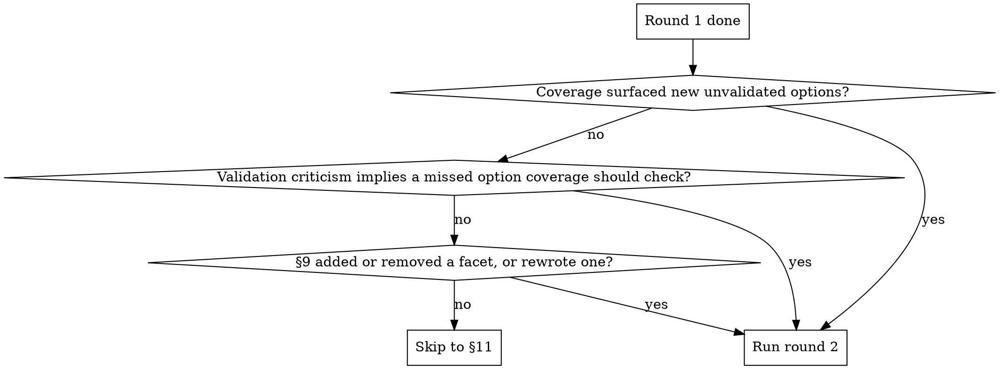

# Research

## What this skill produces

A saved markdown file at `docs/research/YYYY-MM-DD-<slug>.md` (or a path you choose if not in a repo). The file contains a humanized, reviewer-checked report answering the user's question with cited web and optional local-code evidence.

Anything less — a chat-only answer, an unreviewed draft, an unsaved draft — is an incomplete run. There is no partial-success state.

**Announce at start:** "Using the research skill to investigate <topic>."

## Decision tree — where am I in the chain?

    What is in hand right now?
    ├── nothing                      → build the approved plan       (§1–§5)
    ├── approved plan                → build the bullet draft        (§6–§7)
    ├── bullet draft                 → build the reviewed draft      (§8–§10)
    ├── reviewed bullet draft        → build the humanized prose     (§11–§14)
    └── humanized prose              → save the file                 (§15)

The build chain: approved plan (§5) → bullet draft (§7) → reviewed bullet draft (§10) → humanized prose (§14) → saved file (§15). Investigate, expansion review, and prose synthesis build those artifacts; they are not stages you can hand back as an answer. Before replying "here is what I found," check which artifact you hold — if it is not humanized prose saved to disk, the chain is not done.

## Entry contract

Before the first tool call, confirm the deliverable is the saved markdown file at the §15 path and the completion test is whether that file exists with humanized, reviewer-approved prose. At every step, "am I done?" has the same answer: only when the file at §15 exists on disk. If the answer is "no" when you are about to hand back, identify which artifact you are missing and build it — you are not done until the §15 file exists.

## When to use

- Topic has multiple plausible angles or options worth comparing.
- Output is a saved markdown report the user keeps and references later.
- Web evidence, sometimes paired with local code, is the primary input.

## When NOT to use

- One-shot factual lookup such as "what year was X released". Go straight to web search.
- Recall from a past conversation. Search project memory instead.
- Find something in this codebase. Use Grep.
- In-conversation Q&A where the user does not want a saved artifact.
- Topic already covered by a canonical source you can cite without rewriting.

## Tool mapping

Web fetch and web search map to whatever the host runtime provides — call them "your web-fetch tool" and "your web-search tool". The instructions below name capabilities, not products, because this skill is mounted for both Claude Code and Codex. Read local files with `Read` and `Grep` on both runtimes.

Only subagent dispatch is genuinely runtime-specific:

| Action | Claude Code | Codex |
|---|---|---|
| Dispatch §8 reviewers | `Agent` tool → `research-coverage-reviewer`, `research-validation-reviewer` | `spawn` in parallel → `research-coverage-reviewer`, `research-validation-reviewer` |
| Dispatch §12 draft reviewer | `Agent` tool (general-purpose) | subagent (general-purpose) |

## Phases

The 15 phases group into three stages: **Plan** (§1–§5), **Investigate** (§6–§10), **Write** (§11–§15).

### Plan

#### §1 — Intake (produces: intake assumptions)

**Input:** user request.
**Output:** intake assumptions that §3 will use to draft facets.

Ask clarifying questions one at a time. Cap at 3-4. Skip when the topic is already specific. Accept "just go" or similar as an immediate exit from intake (this exits intake only, not the plan checkpoint in §5).

Typical questions: scope (academic vs practitioner), audience (background level), time horizon, what existing knowledge to assume.

#### §2 — Project relevance (produces: facet-scope hint)

**Input:** intake assumptions.
**Output:** a flag on whether facets need local file inspection, passed into §3.

Test: does the topic name a tech, library, concept, or pattern the current repo uses? If yes, mark which facets benefit from local file inspection. If no, web-only.

#### §3 — Plan: 3-7 facets (produces: draft facet list)

**Input:** intake assumptions + project-relevance flag.
**Output:** the draft facet list §4 critiques.

Pick distinct angles. Per-option weak points and dissent are covered by the validation reviewer in §8, so a dedicated dissent facet is unnecessary.

Angle hints, pick what fits:
- Programming / CS: how-it-works, practitioner experience, criticisms, alternatives, history.
- Books / media recs: well-regarded, overrated, lesser-known, adjacent topics, critical reception.
- Historical / factual: primary sources, scholarly consensus, revisionist views.
- Decisions / comparisons: pros, cons, hidden tradeoffs, what experienced people pick.
- "What should I learn next" type: case for, case against, prerequisites, what comes after.

#### §4 — Plan self-review (produces: revised facet list)

**Input:** draft facet list.
**Output:** revised facet list ready to show the user in §5.

Single critique pass. Checklist:
- Are angles genuinely distinct, or are two of them basically the same?
- Are there obvious gaps for the topic type?

If any check fails, revise once and re-check. Cap at one revision. If the second draft still fails, ship it with the unresolved gaps noted in a one-line self-review summary. Show the user only the post-revision version.

#### §5 — User confirms plan (produces: approved plan)

**Input:** revised facet list.
**Output:** approved plan — the first named artifact in the build chain.

**Mandatory checkpoint.** The user can edit, drop, or add facets. Wait for OK before investigating.

**Why mandatory:** facet selection is where most drift originates. A misframed plan produces a misframed report; later phases polish prose but cannot reframe the question.

### Investigate

#### §6 — Investigate (produces: raw evidence for the bullet draft)

**Input:** approved plan.
**Output:** per-facet quotes, URLs, and preliminary cons — the raw material §7 consumes. Not an answer for the user; not the end of the chain.

For each facet:
- Web search (your web-search tool) to discover blogs and forums, then fetch the most promising sources with your web-fetch tool.
- Reach real human opinion through the named sources below, not just the top web-search results.
- Light counter-evidence sweep ("X criticisms", "problems with X", "X overrated"). Enough to fill preliminary cons in the bullet draft.
- For project-relevant facets: also read the relevant local files.

Collect quotes, URLs, and per-facet preliminary cons as you go. Pre-fetch the archive evidence each facet needs and carry it into the bullet draft, so the two parallel §8 reviewers lean on already-collected material and spend their own archive calls only on genuine gaps. Three agents hitting the same rate-limited API at once is the failure mode to avoid. For each source, capture its **type** (first-party practitioner/community · independent journalism · vendor/affiliate/SEO), its **signal** (score, comment volume, or star rating where the platform exposes it — archive/API sources like PullPush/arctic-shift/Algolia give it as JSON; blogs give none), and its **date**. These feed the §7 draft and the enriched Sources line.

**Where opinion lives — reach it, with fallbacks when a path is blocked:**

Real human opinion clusters on Reddit, Hacker News, Stack Exchange, lobste.rs, Discourse forums, Goodreads, and practitioner blogs. Reach for it directly with your web-fetch and web-search tools first. Some direct paths are blocked in some environments — this skill was probed on Claude Code, where direct-fetch of reddit.com (and its `.json`/old.reddit.com/Redlib/Teddit mirrors) and stackexchange.com failed; other runtimes may differ, so verify rather than assume. When a direct path fails, fall back to an archive or API instead of dropping the source. The endpoints below are known-good starting points at time of writing, not guarantees or an exhaustive list — probe one before relying on it, and if it is down or blocked, find the current equivalent.

- **Reddit** — largest reservoir of practitioner and consumer opinion. When direct paths are blocked, reach it through archive APIs such as (but not limited to):
  - PullPush threads: `api.pullpush.io/reddit/search/submission/?q=<q>&subreddit=<sub>&size=25&sort=desc&sort_type=score`
  - PullPush comments: `api.pullpush.io/reddit/search/comment/?link_id=<id>&size=100&sort_type=score`
  - arctic-shift (`arctic-shift.photon-reddit.com/api/`) mirrors both and cross-checks freshness — it often surfaces more recent posts than PullPush.
  - Both return JSON with `score`, `num_comments`, `created_utc`, `body`, `author`. When `site:reddit.com` web search is dead, discover threads through the archive's own `q=` search.
- **Hacker News** — the Algolia API stays reachable when `news.ycombinator.com` direct-fetch 429s. Threads: `hn.algolia.com/api/v1/search?query=<q>&tags=story`. Comments: `hn.algolia.com/api/v1/items/<id>`. Returns `points`, `num_comments`, `created_at`.
- **Stack Exchange** — when stackexchange.com direct-fetch is blocked, do not treat it as unreachable without trying web search (its threads are common search hits) or the public API `api.stackexchange.com` (e.g. `/2.3/search/advanced?order=desc&sort=votes&q=<q>&site=stackoverflow`).
- **Direct fetch** (your web-fetch tool) for lobste.rs, Discourse forums, Goodreads, practitioner blogs, and journalism.

**Guards:**
- Your web-search tool's prose summary is not a citable source. Cite only from its returned links array or from pages you actually fetched. (Web search twice emitted confident, citation-shaped, Reddit-flavored prose with zero real links — that prose is not a source.)
- When a direct domain is blocked, use the fallback path above before giving up on the source — do not silently drop Reddit, HN, or Stack Exchange because their front door is closed.
- Archive/API vote and comment counts are approximate snapshots, not live values, and these APIs rate-limit (~15 req/min, 429 on bursts). Treat counts as directional and cross-check one archive against another when recency matters.

#### §7 — Bullet-form tentative draft (produces: bullet draft)

**Input:** raw evidence from §6.
**Output:** bullet draft — the artifact §8's reviewers operate on.

Internal scratch, not shown to the user. Assemble a structured list per facet:

```
## Facet: <title>
- What it is: <one sentence>
- What it gives / implies / achieves: <one sentence>
- Pros / tradeoffs:
  - ...
- Cons / limitations:
  - ...
- Verbatim voices:
  - <attributed quote — author/handle, signal, date>
- Sources used: per source, `<URL> — [type · signal · date]`
  - type: first-party practitioner/community · independent journalism · vendor/affiliate/SEO (a three-bucket filter, not a scoring rubric)
  - signal: score / comment volume / star rating where the platform exposes it; omit for blogs
  - date: the source's own date
```

This is the input to §8.

#### §8 — Expansion review (parallel subagents) (produces: coverage + validation reports)

**Input:** bullet draft (from §7). **Output:** coverage + validation reports for §9.

Spawn two subagents in parallel to review the bullet draft: `research-coverage-reviewer` and `research-validation-reviewer`. Send both spawn requests in one response. Wait for both threads to finish before continuing to §9. Do not ask the user for permission — the skill invocation is the permission for this dispatch.

**`research-coverage-reviewer`.** Finds niche alternatives the main investigation missed. Send it: original question, plan, bullet draft, list of URLs already consulted. Definition at `agents/coverage-reviewer.md` (next to this file).

**`research-validation-reviewer`.** Validates options against real-world opinions and weak points. Send it: original question, plan, bullet draft. Definition at `agents/validation-reviewer.md`.

#### §9 — Integrate findings (produces: updated bullet draft)

**Input:** bullet draft + the two §8 reports. **Output:** updated bullet draft — new options merged, validation criticisms attached to the right facets.

Update the bullet draft:
- New options from coverage become new facet entries (or attach to existing facets per the reviewer's "Target facet" suggestion).
- Validation findings go into the relevant facet's cons. Topic-wide criticism gets collected separately for the conditional standalone "Dissenting views" section.
- For new options needing preliminary investigation: 1-2 most promising sources per option, no full counter-evidence sweep at this stage.

#### §10 — Round 2 decision (produces: reviewed bullet draft)

**Input:** updated bullet draft.
**Output:** reviewed bullet draft — the artifact §11 turns into prose.


```dot
digraph round2 {
    "Round 1 done" [shape=box];
    "Coverage surfaced new unvalidated options?" [shape=diamond];
    "Validation criticism implies a missed option coverage should check?" [shape=diamond];
    "§9 added or removed a facet, or rewrote one?" [shape=diamond];
    "Run round 2" [shape=box];
    "Skip to §11" [shape=box];

    "Round 1 done" -> "Coverage surfaced new unvalidated options?";
    "Coverage surfaced new unvalidated options?" -> "Run round 2" [label="yes"];
    "Coverage surfaced new unvalidated options?" -> "Validation criticism implies a missed option coverage should check?" [label="no"];
    "Validation criticism implies a missed option coverage should check?" -> "Run round 2" [label="yes"];
    "Validation criticism implies a missed option coverage should check?" -> "§9 added or removed a facet, or rewrote one?" [label="no"];
    "§9 added or removed a facet, or rewrote one?" -> "Run round 2" [label="yes"];
    "§9 added or removed a facet, or rewrote one?" -> "Skip to §11" [label="no"];
}
```

All three diamonds "no" means the pass is already complete — skip to §11.

**Hard cap: 2 rounds total.** Past round 2, reviewers tend to re-surface the same critiques rather than find new ones; cost grows, signal does not.

### Write

#### §11 — Synthesize prose draft (produces: prose draft)

**Input:** reviewed bullet draft.
**Output:** prose draft ready for §12's fresh-context reviewer.

Expand the bullet draft into the full prose report using the output template below. Produce the `## Recommendation` section: state the pick tailored to the asker's stated constraints, why it wins on cited evidence, a confidence level, and the conditions that flip it. Draw the flip-conditions from the strongest credible dissent the validation reviewer surfaced, so the recommendation survives its best counter-argument instead of leaving dissent as a detached appendix. Weave attributed verbatim quotes into each facet's prose — real voices with signal and date, not only laundered analytical summary. Claims are weighted by triangulation across independent communities, not by raw count from a single venue.

#### §12 — Subagent review (fresh context) (produces: three-tier reviewer findings)

**Input:** prose draft.
**Output:** three-tier findings §13 applies.

Dispatch the existing draft reviewer with: the prose draft, the original question, the intake assumptions, and the plan. Reviewer prompt at `reviewer-prompt.md` (next to this file). Returns:
- **Critical:** factual errors, unsupported claims, scope drift, internal contradictions.
- **Suggested:** weak phrasing, unclear sections, citations to add.
- **Nit:** style nits.

#### §13 — Revise (produces: revised prose)

**Input:** prose draft + reviewer findings.
**Output:** revised prose. Loops with §12 until §12 returns zero critical findings.

Apply all critical findings. Apply most suggested. Skip nits unless trivial. Loop back to §12 until zero critical findings.

**Hard cap: 5 review rounds total.** Loops past 5 are usually disagreements about taste, not unfixed defects. If the cap is hit without approval, do not silently save. Surface to the user the recurring unresolved findings and three choices: (a) save as-is and accept the gaps, (b) hand back for manual edits, (c) abort and discard.

#### §14 — Humanizer pass (produces: humanized prose)

**Input:** revised prose.
**Output:** humanized prose — the last non-file artifact in the chain.

**REQUIRED SUB-SKILL:** Use the `humanizer` skill on the prose (TL;DR, facet sections, conditional dissent section). Skip code blocks, file paths, URLs, structured lists.

Skip this and the report reads as obviously machine-generated. Readers tend to discount AI-flavored prose even when the facts hold up.

#### §15 — Save (produces: saved file — the run is now complete)

**Input:** humanized prose.
**Output:** the saved markdown file. The entry contract is satisfied only when this file exists.

Write to `docs/research/YYYY-MM-DD-<slug>.md` if in a git repo. Otherwise ask. Do not auto-commit.

## Common mistakes

| Rationalization | Reality |
|---|---|
| "Topic is simple, skip the plan checkpoint." | Facet selection is where drift starts. The gate is cheap. |
| "Reviewers will say similar things, dispatch sequentially." | Sequential dispatch lets reviewer 1 frame reviewer 2. The point of parallel dispatch is keeping the two reviews independent, not faster wall time. |
| "Round 1 looked thorough, skip round 2 even though new options surfaced." | Unvalidated additions defeat the validation gate. Either run round 2 or drop the new options. |
| "User wants it fast, skip the humanizer pass." | A report that reads as AI gets discounted regardless of accuracy. |
| "5 rounds is the target." | 5 is the cap, not the target. Stop as soon as critical findings hit zero. |
| "User said 'just go', so I will skip plan confirmation too." | "Just go" exits intake (§1). §5 is a separate gate. |
| "Web search alone is enough, skip the bullet draft." | The bullet draft is the input the reviewers operate on. Without one there is nothing for them to review. |

## Red flags — STOP

The common-mistakes table above is the single home for the rationalizations. These two fire on an in-the-moment action the table cannot capture:

- About to dispatch the two expansion reviewers sequentially. STOP. Send them in one parallel call.
- About to ask the user for permission to spawn the §8 reviewers. STOP. The user's invocation of this skill is the permission. Spawn them directly.

## Output template

```markdown
# <Title>

**Question:** <verbatim user request>
**Assumptions made during intake:** <bullets, or "none">
**Date:** YYYY-MM-DD

## TL;DR
- 3-5 bullets, one line each

## Quick overview
- <Facet 1 title> — one-sentence essence
- <Facet 2 title> — one-sentence essence

## <Facet 1 title>

**What it is:** 2-4 sentences.

**What it gives / implies / achieves:** 2-4 sentences. Wording adapts to the topic. For option-shaped facets this is "what choosing it gets you". For explanation-shaped facets it is "what this enables / what follows from it".

**Pros / tradeoffs:**
- ...

**Cons / limitations:**
- ...

**Representative voices:** at least one verbatim quote with attribution and signal — a named or handle-attributed comment with its score/stars and date. This is what separates the report from an encyclopedia entry.

A reasoning paragraph that ties the four parts together with inline citations [^N]. This is where the agent argues: why these pros matter for the use case, what the cons rule out, where this option fits among the others.

## <Facet 2 title>
... same structure ...

## Recommendation

**Pick:** <the option or answer, tailored to the asker's stated constraints>.
**Why:** <2-4 sentences grounded in cited evidence>.
**Confidence:** <high / medium / low>, with the reason for that level.
**This flips if:** <the conditions under which the pick changes>. Derive these from the strongest credible dissent the validation reviewer surfaced — the recommendation has to survive its best counter-argument.

## Dissenting views (conditional)

Present only when the validation reviewer surfaced topic-wide criticism that does not fit any single facet's cons or the Recommendation's flip-conditions. Drop the section entirely when there is nothing to put here.

## Open questions / could not verify
- <gaps the reviewer flagged that didn't get resolved>

## Sources
[^1]: <Title> — [type · signal · date] — <URL>
[^2]: <Title> — [type · signal · date] — <URL>

`[type · signal · date]`: type is first-party practitioner/community · independent journalism · vendor/affiliate/SEO; signal is score / comment volume / star rating where the platform exposes it, omitted otherwise; date is the source's own date. This lets a reader audit how the opinion was weighed.
```
