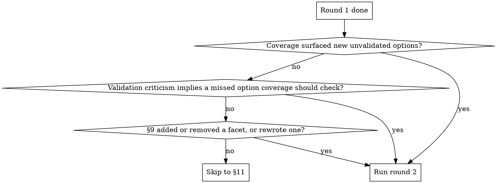

# Research

## What this skill produces

A saved markdown file at `docs/research/YYYY-MM-DD-<slug>.md` (or a path you choose if not in a repo). The file contains a humanized, reviewer-checked report answering the user's question with cited web and optional local-code evidence.

Anything less — a chat-only answer, an unreviewed draft, an unsaved draft — is an incomplete run. There is no partial-success state.

**Announce at start:** "Using the research skill to investigate <topic>."

## Decision tree — where am I in the chain?

    What is in hand right now?
    ├── nothing                      → build the approved plan       (§1–§5)
    ├── approved plan                → build the bullet draft        (§6–§7)
    ├── bullet draft                 → build the reviewed draft      (§8–§10)
    ├── reviewed bullet draft        → build the humanized prose     (§11–§14)
    └── humanized prose              → save the file                 (§15)

The build chain: approved plan (§5) → bullet draft (§7) → reviewed bullet draft (§10) → humanized prose (§14) → saved file (§15). Investigate, expansion review, and prose synthesis build those artifacts; they are not stages you can hand back as an answer. Before replying "here is what I found," check which artifact you hold — if it is not humanized prose saved to disk, the chain is not done.

## Entry contract

Before the first tool call, confirm the deliverable is the saved markdown file at the §15 path and the completion test is whether that file exists with humanized, reviewer-approved prose. At every step, "am I done?" has the same answer: only when the file at §15 exists on disk. If the answer is "no" when you are about to hand back, identify which artifact you are missing and build it — you are not done until the §15 file exists.

## Wayfinder research-ticket mode

Branch first on whether the invocation supplies a research-ticket path. Direct `/research` without a ticket stays tracker-free: do not read, claim, create, select, or mutate a ticket.

With a ticket path, retain its canonical repository-root-relative path for the whole run. Before any write, call Wayfinder's ticket-level mutation primitive in validation-only mode. That mode acquires the edit lock, rereads and validates the expected state, then unlocks without a temporary file, rename, field change, or `revision` increment. Under its lock/CAS contract, require a canonical repository-root-relative regular file with `type: research`, `status: open`, `phase: research`, the current `revision`, a caller-owned active `claimed-by`, no active `blocked-by`, and empty `findings`. Resolve with `realpath -e`; reject absolute, escaping, symlinked, missing, directory, noncanonical, stale, blocked, or mismatched inputs without writing.

The validated ticket body must contain exactly one non-empty `## Question` block. Its text is the original research question supplied to intake and both reviewer pipelines. A report is reusable only when its verbatim `Question` field exactly equals that validated `## Question` text. A missing, duplicate, or empty Question block is a no-write rejection.

After validation and before §1, reconcile reports under `docs/research/`. A reusable report contains exactly one `## Wayfinder ticket handoff` heading followed by one YAML block with the canonical ticket path, the ticket's numeric id as `origin-ticket-id`, and `next-phase: wayfinder:resolve`:

## Wayfinder ticket handoff

```yaml
ticket: docs/superpowers/wayfinder/example/tickets/01-question.md
origin-ticket-id: 1
next-phase: wayfinder:resolve
```

Count only reports with fully valid handoff blocks and a verbatim `Question` field that exactly equals the validated ticket's `## Question` text. A missing key, extra handoff heading or block, wrong ticket, wrong id, wrong phase, absolute or noncanonical path, partial block, malformed YAML, or Question mismatch is not reusable.

- Zero reusable reports: run the ordinary research pipeline.
- One reusable report: the handoff metadata proves ticket association but not that the saved file came from the user-approved facet plan and completed reviewer pipeline. Ask the user to confirm that provenance. On confirmation, canonicalize the report path, confirm its Question still exactly equals the validated ticket Question, and retry the guarded ticket update without repeating research.
- Multiple reusable reports: stop without writing and ask which report is canonical. After the user selects one, confirm its Question still exactly equals the validated ticket Question before the provenance gate or any ticket mutation.
- Malformed or partial reports: ignore them for reuse. If no valid report remains, run the ordinary pipeline.

For a new report, run §1 through §14 unchanged, including the §5 facet-plan approval gate and both §8 reviewers. Section 15 saves the report produced from that user-approved facet plan and completed reviewer pipeline, with a verbatim `Question` field that exactly equals the validated ticket Question, then appends exactly one valid handoff block using the original canonical ticket path, its numeric id, and `next-phase: wayfinder:resolve`. The saved report is the artifact; a missing, malformed, mismatched, or duplicate handoff block, or a Question mismatch, prevents any ticket write. There is no new final-report approval gate.

Only after a completed, validated report exists, release and hand off in this order: terminate the ticket's claim-liveness holder using the durable PID stored in Wayfinder's lock file, as required by Wayfinder's Release contract; acquire the ticket mutation primitive's edit lock and revalidate the report and ticket; then CAS-advance the phase, write `findings`, and clear the owner. While locked, require the report's verbatim `Question` field to still exactly equal the validated ticket's `## Question` text before any ticket mutation. Call the mutation primitive against the same original ticket path with the expected revision, status, phase, and owner, then CAS-update:

```yaml
status: open
phase: wayfinder:resolve
findings: <canonical root-relative docs/research report path>
claimed-by:
```

CAS-advance `phase` to `wayfinder:resolve`, write `findings`, and clear `claimed-by`; retain `map-path`, `blocked-by`, `revision` semantics, unknown frontmatter, and the ticket body. Do not write the ticket directly. A declined facet-plan approval — the user ending the run at §5, not a "none of these framings" steer, which is a re-draft — or an interrupted run leaves the ticket unchanged and claimed in `phase: research`; after the session ends, the stale claim follows Wayfinder recovery. If CAS fails after saving the completed report, keep the report and leave the ticket unchanged. The next claimant reconciles and retries against that intact report instead of repeating research. Report production still has no partial-success state, while report creation and ticket mutation remain separate, idempotent operations.

Only after that successful CAS release, announce the saved report and return path, then emit the `/clear` trailer. Use the current runtime's handoff syntax:

- Claude Code: `/clear`, then `/wayfinder <map-path>`.
- Codex: `/clear`, then `$wayfinder <map-path>`.

Without a successful ticket update, emit no Wayfinder trailer.

## When to use

- Topic has multiple plausible angles or options worth comparing.
- Output is a saved markdown report the user keeps and references later.
- Web evidence, sometimes paired with local code, is the primary input.

## When NOT to use

- One-shot factual lookup such as "what year was X released". Go straight to web search.
- Recall from a past conversation. Search project memory instead.
- Find something in this codebase. Use Grep.
- In-conversation Q&A where the user does not want a saved artifact.
- Topic already covered by a canonical source you can cite without rewriting.

## Tool mapping

Web fetch and web search map to whatever the host runtime provides — call them "your web-fetch tool" and "your web-search tool". The instructions below name capabilities, not products, because this skill is mounted for both Claude Code and Codex. Read local files with `Read` and `Grep` on both runtimes.

Only subagent dispatch is genuinely runtime-specific:

| Action | Claude Code | Codex |
|---|---|---|
| Dispatch §2.5 landscape scout | `Agent` tool → `research-landscape-scout` | `spawn` → `research-landscape-scout` |
| Dispatch §8 reviewers | `Agent` tool → `research-coverage-reviewer`, `research-validation-reviewer` | `spawn` in parallel → `research-coverage-reviewer`, `research-validation-reviewer` |
| Dispatch §12 draft reviewer | `Agent` tool (general-purpose) | subagent (general-purpose) |

## Phases

The 16 phases group into three stages: **Plan** (§1–§5), **Investigate** (§6–§10), **Write** (§11–§15).

### Plan

#### §1 — Intake (produces: intake assumptions)

**Input:** user request.
**Output:** intake assumptions that §2.5 and §3 use to draft facets.

Ask clarifying questions one at a time. Cap at 3-4. Skip when the topic is already specific. Accept "just go" or similar as an immediate exit from intake (this exits intake only, not the plan checkpoint in §5).

Typical questions: scope (academic vs practitioner), audience (background level), time horizon, what existing knowledge to assume.

#### §2 — Project relevance (produces: facet-scope hint)

**Input:** intake assumptions.
**Output:** a flag on whether facets need local file inspection, passed into §2.5 and §3.

Test: does the topic name a tech, library, concept, or pattern the current repo uses? If yes, mark which facets benefit from local file inspection. If no, web-only.

#### §2.5 — Landscape spike (produces: landscape sketch)

**Input:** the original user question, the intake assumptions from §1, the project-relevance flag from §2.
**Output:** the landscape sketch — what §3 drafts against, and what §6 takes its seed URLs from.

Dispatch `research-landscape-scout` (see the tool-mapping table) with those three inputs and nothing else. One dispatch, not a fan-out. Run it on every topic: "do I already know this landscape?" is the self-assessment that fails confidently.

The scout returns:

```markdown
## Landscape sketch
- **Named options / tools / camps:** up to 8, bare names
- **Where practitioners disagree:** 2-4 bullets, one line each
- **Distinct sub-topics:** 3-6 bullets, one line each
- **Anchor URLs:** 3-5, each `<URL> — [type · signal · date]`
- **Blank spots:** what it looked for and could not find
```

**Usability bar.** The sketch is usable only when all five labelled fields are present under the `## Landscape sketch` heading and at least one anchor URL fetches successfully. Check both here, before drafting, and check them mechanically — the realistic bad case is a half-formed sketch with two fields filled in, judged by the same agent that benefits from calling it good enough. That fetch is also §3's precondition, so it costs one request rather than two.

**Below the bar** — the scout failed, timed out, returned fewer than five fields, or no anchor URL fetched — §3 drafts from priors instead (the angle hints), and §5 states plainly that the spike failed and the plan came from priors. The run continues; the spike improves plan quality, it does not gate the run. The fallback is fine; silent substitution is the violation.

**Above the bar but sparse** is the other case. Proceed with broader amendments and show the blank-spots field at §5, so the user can see the amendments are thin because the landscape is. Sparse is not a licence to skip the amendment structure.

#### §3 — Plan: core facets plus amendments (produces: core, amendments, recommendation)

**Input:** landscape sketch (§2.5) + intake assumptions (§1) + project-relevance flag (§2).
**Output:** the core, 2-3 amendments — one only under the hard rule below — and one recommendation. That is what §4 critiques.

The plan splits into a settled part and a contested part. The **core** holds the facets any defensible framing includes; it is stated, not debated. The **amendments** are competing bundles of the contested facets. The user decides only the contested part.

**Core — 2-4 facets, one gloss line each.** A facet belongs in the core only if a report omitting it would not answer the question as asked. That test is about the question, not about the amendment set: "every amendment would include it" is satisfiable by construction, since this one pass writes both.

**Amendments — 2-3 competing bundles of 1-3 facets each.** Each carries a name, a one-line thesis, its facets with a gloss apiece, then explicit **Pros** and **Cons**. At least one is authored as a deliberate opposite framing of the question, not a variant of the recommended one, or the set drifts into three flavors of the same investigation.

Every disagreement axis carried out of the sketch, and every amendment thesis, cites an anchor URL you fetched successfully — §2.5's one fetch is a floor, not a cap, so fetch the anchors the axes you carry forward actually rest on. An axis with no citable anchor cannot become an amendment thesis: a hallucinated URL dies at the first failed fetch, but a hallucinated *disagreement axis* would pass straight into Amendment B and send §6 off to investigate something nobody disagrees about.

Core plus any single amendment must land inside the 3-7 facet range that §6, §8, and §12 expect. That is what bounds the core at 4 and each amendment at 3.

**Recommendation.** Name one amendment and argue for it in 2-4 sentences grounded in the intake assumptions and the sketch. "Amendment B, because you said you are evaluating this for production and the sketch shows the disagreement clustering on operational cost" qualifies. "Amendment B offers a good balance" does not — it would read identically for any topic, which is the tell.

**Hard rule: minimum two amendments.** Collapsing to a single framing and presenting it as inevitable is the failure this phase exists to prevent. If the sketch genuinely supports only one, present the core plus that one amendment and state in one line what you looked for and why no second framing survived.

**Priors fallback.** Below §2.5's usability bar, draft from the intake assumptions, the relevance flag, and the angle hints below. Same structure — a core, two or more amendments, a recommendation — but nothing is anchored, so no thesis cites a URL and §5 says the spike failed.

Per-option weak points and dissent are covered by the validation reviewer in §8, so a dedicated dissent facet is unnecessary.

Angle hints, pick what fits:
- Programming / CS: how-it-works, practitioner experience, criticisms, alternatives, history.
- Books / media recs: well-regarded, overrated, lesser-known, adjacent topics, critical reception.
- Historical / factual: primary sources, scholarly consensus, revisionist views.
- Decisions / comparisons: pros, cons, hidden tradeoffs, what experienced people pick.
- "What should I learn next" type: case for, case against, prerequisites, what comes after.

#### §4 — Plan self-review (produces: revised core, amendments, recommendation)

**Input:** the core, amendments, and recommendation from §3.
**Output:** the revised versions of all three, ready to show the user in §5.

Single critique pass. Checklist:
- Is each core facet one whose omission would leave the question unanswered? Anything weaker belongs in an amendment.
- Are the amendments genuinely different research, or the same facets reworded? Two that would send the investigation to the same sources are one amendment, and at least one has to be a genuine opposite framing rather than a variant. With a justified single amendment: is its justification line present?
- Does core plus each amendment individually land in 3-7 facets?
- Is the recommendation specific to this question, or would it survive a find-and-replace of the topic?
- Do the amendments cover the sketch's disagreement axes, and does every axis and thesis cite an anchor that was actually fetched?

If any check fails, revise once and re-check. Cap at one revision. If the second draft still fails, ship it with the unresolved gaps noted in a one-line self-review summary. Show the user only the post-revision version.

#### §5 — User picks an amendment (produces: approved plan)

**Input:** the revised core, amendments, and recommendation.
**Output:** approved plan — the first named artifact in the build chain, and a flat 3-7 facet list.

**Mandatory checkpoint.** Present, in this order: the compressed landscape sketch when one exists, including its blank-spots field; the core; each amendment with its thesis, the anchor URL that thesis cites when the plan is anchored, and its pros and cons; and the recommendation. When the sketch fell below §2.5's usability bar, say so here in plain words.

The user picks one amendment, and can also edit, drop, or add facets in the core and the amendments alike, so grafting a facet out of a rejected amendment needs no separate mechanism. Wait for OK before investigating.

After any edit or graft, re-check that the resulting facet list is within 3-7. A core of 4 plus a 3-facet amendment already sits at the ceiling, so one graft pushes it to 8: over the ceiling, ask which facet to drop; under the floor, ask which to add back. Both bounds are the flat list's contract with §6, §8, and §12, not a style preference.

**"None of these framings" is a supported answer, not a decline.** Naming two or three framings invites a fourth-option response, and "your axes are wrong" is not an edit to any single bundle. The steer re-enters §3 for one re-draft, §4 reviews the result, and that re-draft does not consume a second §4 revision. **Decline** means the user ends the run — nothing weaker.

**The approved plan is flat.** Emit the flattened union of the core and the chosen amendment: a plain 3-7 facet list, the shape §6, §8, and §12 already consume. The two-level object never leaves the gate — the §8 reviewers and §6 both specify their input as the flat facet list.

**Why mandatory:** facet selection is where most drift originates, and this is the last point at which the framing can change at all. A misframed plan produces a misframed report; later phases polish prose but cannot reframe the question.

### Investigate

#### §6 — Investigate (produces: raw evidence for the bullet draft)

**Input:** approved plan + the sketch's anchor URLs from §2.5, when a usable sketch exists.
**Output:** per-facet quotes, URLs, and preliminary cons — the raw material §7 consumes. Not an answer for the user; not the end of the chain.

Start from the sketch's anchor URLs when a usable sketch exists: fetch the ones that bear on a facet before searching for new sources, since re-discovering what §2.5 already found costs a search each. They are seeds, never citations — Sources contains only URLs you actually fetched during investigation. Entering §6 without a sketch (a resumed run, a Wayfinder handoff, a below-bar spike) means searching from scratch as before.

For each facet:
- Web search (your web-search tool) to discover blogs and forums, then fetch the most promising sources with your web-fetch tool.
- Reach real human opinion through the named sources below, not just the top web-search results.
- Light counter-evidence sweep ("X criticisms", "problems with X", "X overrated"). Enough to fill preliminary cons in the bullet draft.
- For project-relevant facets: also read the relevant local files.

Collect quotes, URLs, and per-facet preliminary cons as you go. Pre-fetch the archive evidence each facet needs and carry it into the bullet draft, so the two parallel §8 reviewers lean on already-collected material and spend their own archive calls only on genuine gaps. Three agents hitting the same rate-limited API at once is the failure mode to avoid. For each source, capture its **type** (first-party practitioner/community · independent journalism · vendor/affiliate/SEO), its **signal** (score, comment volume, or star rating where the platform exposes it — archive/API sources like PullPush/arctic-shift/Algolia give it as JSON; blogs give none), and its **date**. These feed the §7 draft and the enriched Sources line.

**Where opinion lives — reach it, with fallbacks when a path is blocked:**

Real human opinion clusters on Reddit, Hacker News, Stack Exchange, lobste.rs, Discourse forums, Goodreads, and practitioner blogs. Reach for it directly with your web-fetch and web-search tools first. Some direct paths are blocked in some environments — this skill was probed on Claude Code, where direct-fetch of reddit.com (and its `.json`/old.reddit.com/Redlib/Teddit mirrors) and stackexchange.com failed; other runtimes may differ, so verify rather than assume. When a direct path fails, fall back to an archive or API instead of dropping the source. The endpoints below are known-good starting points at time of writing, not guarantees or an exhaustive list — probe one before relying on it, and if it is down or blocked, find the current equivalent.

- **Reddit** — largest reservoir of practitioner and consumer opinion. When direct paths are blocked, reach it through archive APIs such as (but not limited to):
  - PullPush threads: `api.pullpush.io/reddit/search/submission/?q=<q>&subreddit=<sub>&size=25&sort=desc&sort_type=score`
  - PullPush comments: `api.pullpush.io/reddit/search/comment/?link_id=<id>&size=100&sort_type=score`
  - arctic-shift (`arctic-shift.photon-reddit.com/api/`) mirrors both and cross-checks freshness — it often surfaces more recent posts than PullPush.
  - Both return JSON with `score`, `num_comments`, `created_utc`, `body`, `author`. When `site:reddit.com` web search is dead, discover threads through the archive's own `q=` search.
- **Hacker News** — the Algolia API stays reachable when `news.ycombinator.com` direct-fetch 429s. Threads: `hn.algolia.com/api/v1/search?query=<q>&tags=story`. Comments: `hn.algolia.com/api/v1/items/<id>`. Returns `points`, `num_comments`, `created_at`.
- **Stack Exchange** — when stackexchange.com direct-fetch is blocked, do not treat it as unreachable without trying web search (its threads are common search hits) or the public API `api.stackexchange.com` (e.g. `/2.3/search/advanced?order=desc&sort=votes&q=<q>&site=stackoverflow`).
- **Direct fetch** (your web-fetch tool) for lobste.rs, Discourse forums, Goodreads, practitioner blogs, and journalism.

**Guards:**
- Your web-search tool's prose summary is not a citable source. Cite only from its returned links array or from pages you actually fetched. (Web search twice emitted confident, citation-shaped, Reddit-flavored prose with zero real links — that prose is not a source.)
- When a direct domain is blocked, use the fallback path above before giving up on the source — do not silently drop Reddit, HN, or Stack Exchange because their front door is closed.
- Archive/API vote and comment counts are approximate snapshots, not live values, and these APIs rate-limit (~15 req/min, 429 on bursts). Treat counts as directional and cross-check one archive against another when recency matters.

#### §7 — Bullet-form tentative draft (produces: bullet draft)

**Input:** raw evidence from §6.
**Output:** bullet draft — the artifact §8's reviewers operate on.

Internal scratch, not shown to the user. Assemble a structured list per facet:

```
## Facet: <title>
- What it is: <one sentence>
- What it gives / implies / achieves: <one sentence>
- Pros / tradeoffs:
  - ...
- Cons / limitations:
  - ...
- Verbatim voices:
  - <attributed quote — author/handle, signal, date>
- Sources used: per source, `<URL> — [type · signal · date]`
  - type: first-party practitioner/community · independent journalism · vendor/affiliate/SEO (a three-bucket filter, not a scoring rubric)
  - signal: score / comment volume / star rating where the platform exposes it; omit for blogs
  - date: the source's own date
```

This is the input to §8.

#### §8 — Expansion review (parallel subagents) (produces: coverage + validation reports)

**Input:** bullet draft (from §7). **Output:** coverage + validation reports for §9.

Spawn two subagents in parallel to review the bullet draft: `research-coverage-reviewer` and `research-validation-reviewer`. Send both spawn requests in one response. Wait for both threads to finish before continuing to §9.

**`research-coverage-reviewer`.** Finds niche alternatives the main investigation missed. Send it: original question, plan, bullet draft, list of URLs already consulted. Definition at `agents/coverage-reviewer.md` (next to this file).

**`research-validation-reviewer`.** Validates options against real-world opinions and weak points. Send it: original question, plan, bullet draft. Definition at `agents/validation-reviewer.md`.

#### §9 — Integrate findings (produces: updated bullet draft)

**Input:** bullet draft + the two §8 reports. **Output:** updated bullet draft — new options merged, validation criticisms attached to the right facets.

Update the bullet draft:
- New options from coverage become new facet entries (or attach to existing facets per the reviewer's "Target facet" suggestion).
- Validation findings go into the relevant facet's cons. Topic-wide criticism gets collected separately for the conditional standalone "Dissenting views" section.
- For new options needing preliminary investigation: 1-2 most promising sources per option, no full counter-evidence sweep at this stage.

#### §10 — Round 2 decision (produces: reviewed bullet draft)

**Input:** updated bullet draft.
**Output:** reviewed bullet draft — the artifact §11 turns into prose.


```dot
digraph round2 {
    "Round 1 done" [shape=box];
    "Coverage surfaced new unvalidated options?" [shape=diamond];
    "Validation criticism implies a missed option coverage should check?" [shape=diamond];
    "§9 added or removed a facet, or rewrote one?" [shape=diamond];
    "Run round 2" [shape=box];
    "Skip to §11" [shape=box];

    "Round 1 done" -> "Coverage surfaced new unvalidated options?";
    "Coverage surfaced new unvalidated options?" -> "Run round 2" [label="yes"];
    "Coverage surfaced new unvalidated options?" -> "Validation criticism implies a missed option coverage should check?" [label="no"];
    "Validation criticism implies a missed option coverage should check?" -> "Run round 2" [label="yes"];
    "Validation criticism implies a missed option coverage should check?" -> "§9 added or removed a facet, or rewrote one?" [label="no"];
    "§9 added or removed a facet, or rewrote one?" -> "Run round 2" [label="yes"];
    "§9 added or removed a facet, or rewrote one?" -> "Skip to §11" [label="no"];
}
```

All three diamonds "no" means the pass is already complete — skip to §11.

**Hard cap: 2 rounds total.** Past round 2, reviewers tend to re-surface the same critiques rather than find new ones; cost grows, signal does not.

### Write

#### §11 — Synthesize prose draft (produces: prose draft)

**Input:** reviewed bullet draft.
**Output:** prose draft ready for §12's fresh-context reviewer.

Expand the bullet draft into the full prose report using the output template below. Produce the `## Recommendation` section: state the pick tailored to the asker's stated constraints, why it wins on cited evidence, a confidence level, and the conditions that flip it. Draw the flip-conditions from the strongest credible dissent the validation reviewer surfaced, so the recommendation survives its best counter-argument instead of leaving dissent as a detached appendix. Weave attributed verbatim quotes into each facet's prose — real voices with signal and date, not only laundered analytical summary. Claims are weighted by triangulation across independent communities, not by raw count from a single venue.

#### §12 — Subagent review (fresh context) (produces: three-tier reviewer findings)

**Input:** prose draft.
**Output:** three-tier findings §13 applies.

Dispatch the existing draft reviewer with: the prose draft, the original question, the intake assumptions, and the plan. Reviewer prompt at `reviewer-prompt.md` (next to this file). Returns:
- **Critical:** factual errors, unsupported claims, scope drift, internal contradictions.
- **Suggested:** weak phrasing, unclear sections, citations to add.
- **Nit:** style nits.

#### §13 — Revise (produces: revised prose)

**Input:** prose draft + reviewer findings.
**Output:** revised prose. Loops with §12 until §12 returns zero critical findings.

Apply all critical findings. Apply most suggested. Skip nits unless trivial. Loop back to §12 until zero critical findings.

**Hard cap: 5 review rounds total.** Loops past 5 are usually disagreements about taste, not unfixed defects. If the cap is hit without approval, do not silently save. Surface to the user the recurring unresolved findings and three choices: (a) save as-is and accept the gaps, (b) hand back for manual edits, (c) abort and discard.

#### §14 — Humanizer pass (produces: humanized prose)

**Input:** revised prose.
**Output:** humanized prose — the last non-file artifact in the chain.

**REQUIRED SUB-SKILL:** Use the `humanizer` skill on the prose (TL;DR, facet sections, conditional dissent section). Skip code blocks, file paths, URLs, structured lists.

Skip this and the report reads as obviously machine-generated. Readers tend to discount AI-flavored prose even when the facts hold up.

#### §15 — Save (produces: saved file — the run is now complete)

**Input:** humanized prose.
**Output:** the saved markdown file. The entry contract is satisfied only when this file exists.

Write to `docs/research/YYYY-MM-DD-<slug>.md` if in a git repo. Otherwise ask. Do not auto-commit.

## Common mistakes

| Rationalization | Reality |
|---|---|
| "Topic is simple, skip the plan checkpoint." | Facet selection is where drift starts. The gate is cheap. |
| "Reviewers will say similar things, dispatch sequentially." | Sequential dispatch lets reviewer 1 frame reviewer 2. The point of parallel dispatch is keeping the two reviews independent, not faster wall time. |
| "Round 1 looked thorough, skip round 2 even though new options surfaced." | Unvalidated additions defeat the validation gate. Either run round 2 or drop the new options. |
| "User wants it fast, skip the humanizer pass." | A report that reads as AI gets discounted regardless of accuracy. |
| "5 rounds is the target." | 5 is the cap, not the target. Stop as soon as critical findings hit zero. |
| "User said 'just go', so I will skip plan confirmation too." | "Just go" exits intake (§1). §5 is a separate gate. |
| "Web search alone is enough, skip the bullet draft." | The bullet draft is the input the reviewers operate on. Without one there is nothing for them to review. |
| "Sketch was below the usability bar, so I drafted from priors and did not say so." | The fallback is fine; the silence is the violation. §5 states that the spike failed. |
| "Only one framing really makes sense here." | That collapse is what §3 exists to prevent. Present core plus one amendment and state what you looked for. |
| "Topic is familiar, skip the spike." | The spike is unconditional. "I already know this landscape" is the self-assessment that fails confidently. |

## Red flags — STOP

The common-mistakes table above is the single home for the rationalizations. These fire on an in-the-moment action the table cannot capture:

- About to dispatch the two expansion reviewers sequentially. STOP. Send them in one parallel call.
- About to ask the user for permission to spawn the §2.5 scout or the §8 reviewers. STOP. The user's invocation of this skill is the permission. Spawn them directly.
- About to present a single facet list for the user to approve at §5. STOP. That is the pre-amendment behavior. The flat list is what you emit after the pick, not what you offer for it.

## Output template

```markdown
# <Title>

**Question:** <verbatim user request; in research-ticket mode, the validated ticket Question>
**Assumptions made during intake:** <bullets, or "none">
**Date:** YYYY-MM-DD

## TL;DR
- 3-5 bullets, one line each

## Quick overview
- <Facet 1 title> — one-sentence essence
- <Facet 2 title> — one-sentence essence

## <Facet 1 title>

**What it is:** 2-4 sentences.

**What it gives / implies / achieves:** 2-4 sentences. Wording adapts to the topic. For option-shaped facets this is "what choosing it gets you". For explanation-shaped facets it is "what this enables / what follows from it".

**Pros / tradeoffs:**
- ...

**Cons / limitations:**
- ...

**Representative voices:** at least one verbatim quote with attribution and signal — a named or handle-attributed comment with its score/stars and date. This is what separates the report from an encyclopedia entry.

A reasoning paragraph that ties the four parts together with inline citations [^N]. This is where the agent argues: why these pros matter for the use case, what the cons rule out, where this option fits among the others.

## <Facet 2 title>
... same structure ...

## Recommendation

**Pick:** <the option or answer, tailored to the asker's stated constraints>.
**Why:** <2-4 sentences grounded in cited evidence>.
**Confidence:** <high / medium / low>, with the reason for that level.
**This flips if:** <the conditions under which the pick changes>. Derive these from the strongest credible dissent the validation reviewer surfaced — the recommendation has to survive its best counter-argument.

## Dissenting views (conditional)

Present only when the validation reviewer surfaced topic-wide criticism that does not fit any single facet's cons or the Recommendation's flip-conditions. Drop the section entirely when there is nothing to put here.

## Open questions / could not verify
- <gaps the reviewer flagged that didn't get resolved>

## Sources
[^1]: <Title> — [type · signal · date] — <URL>
[^2]: <Title> — [type · signal · date] — <URL>

`[type · signal · date]`: type is first-party practitioner/community · independent journalism · vendor/affiliate/SEO; signal is score / comment volume / star rating where the platform exposes it, omitted otherwise; date is the source's own date. This lets a reader audit how the opinion was weighed.
```
